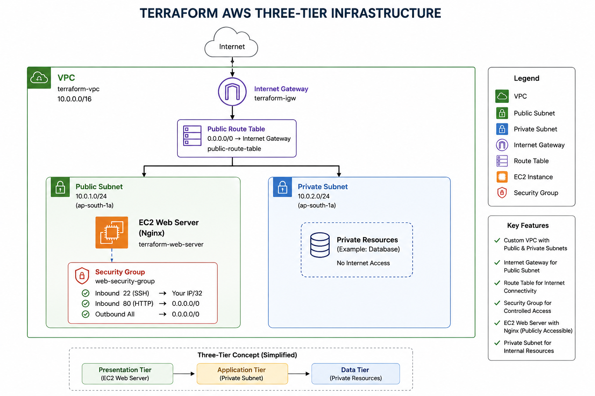
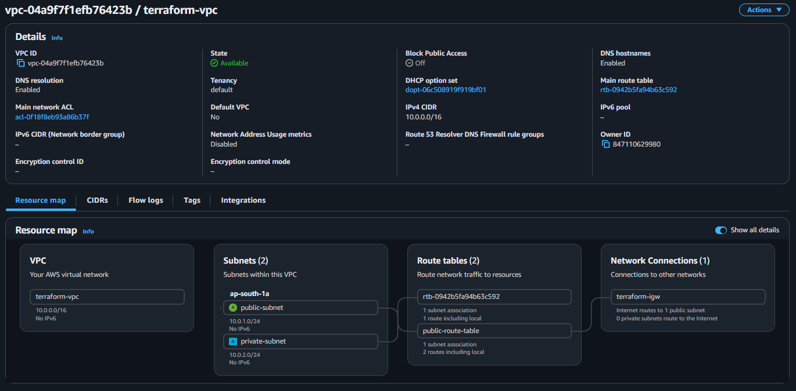
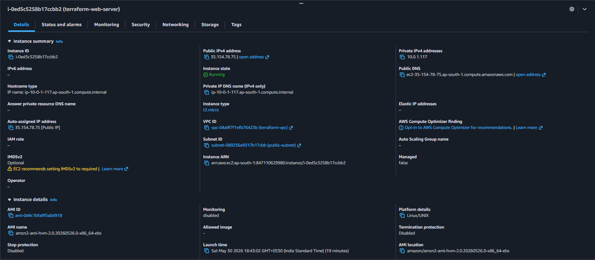
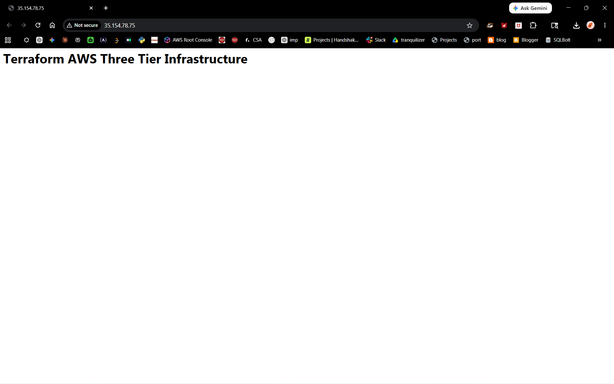

# Terraform-Based-AWS-Three-Tier-Infrastructure-Deployment

## Overview

Designed and deployed a scalable AWS networking environment using Terraform following Infrastructure as Code (IaC) principles.

The infrastructure provisions a custom VPC, public and private subnets, internet connectivity, route management, security controls, and an EC2-based Nginx web server.

## Architecture



## Architecture Components

### Networking
- Created custom VPC (10.0.0.0/16)
- Configured Public Subnet (10.0.1.0/24)
- Configured Private Subnet (10.0.2.0/24)
- Attached Internet Gateway
- Implemented Public Route Table

### Security
- Restricted SSH access to administrator IP
- Allowed HTTP traffic for web access
- Configured outbound internet access

### Compute
- Provisioned Amazon EC2 instance
- Automated Nginx installation using User Data
- Enabled web application hosting

## Technologies Used

- Terraform
- AWS VPC
- AWS EC2
- Internet Gateway
- Route Tables
- Security Groups
- Linux
- Nginx

## Deployment Workflow

```bash
terraform init
terraform validate
terraform fmt
terraform plan
terraform apply
```

## Verification

Validated deployment by:

- Verifying VPC creation
- Confirming subnet association
- Testing internet connectivity
- Confirming Nginx service status
- Accessing the web page through the public IP address

## Deployment Screenshots

### VPC



### EC2 Instance



### Web Server



## Key Learnings

- Implemented Infrastructure as Code using Terraform
- Provisioned AWS resources through declarative configuration
- Configured secure networking using VPCs and Security Groups
- Automated software installation using EC2 User Data
- Managed infrastructure lifecycle using Terraform State
- Applied cloud security best practices through controlled access policies

## Cleanup

To avoid unnecessary AWS charges, all resources were removed after validation.

```bash
terraform destroy
```


